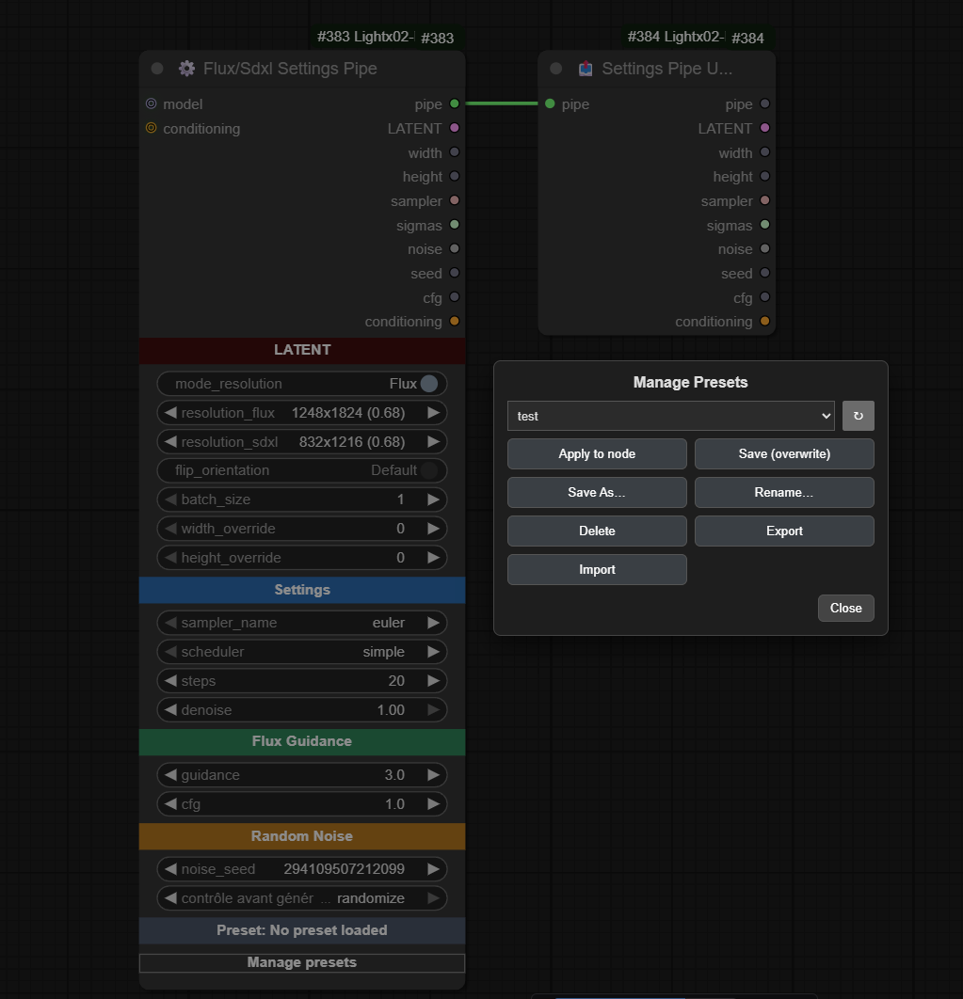

# ComfyUI — ⚙️ Flux/Sdxl Settings Pipe & 📤 Settings Pipe Unpack

**Version**: 1.0.0\
**Author**: [Light-x02](https://github.com/Light-x02)

> These two nodes are designed to simplify **Flux** and **SDXL** workflows: a single node to configure resolution and sampling parameters, and a second node to unpack fields from the **pipe**.

---

## ⚙️ Flux/Sdxl Settings Pipe

### Description

Central node that **prepares settings** for **Flux** *or* **SDXL**. It offers two lists of model-specific resolutions (Flux vs SDXL) and a **switch** (`mode_resolution`) to toggle between them. It computes and outputs a **pipe** (structured object) containing everything needed for proper sampling, along with individual outputs (latent, width/height, sampler, sigmas, etc.).

### Main Features

- **Flux/SDXL switchable mode** (`mode_resolution`) with **resolutions adapted** to each model family.
- **Preset resolutions** + **overrides** (`width_override`, `height_override`) and **flip orientation** (swap W/H) for faster setup.
- **Sampler & Scheduler**: select from ComfyUI’s official samplers and schedulers.
- **Steps & Denoise**: fine control over iteration count and denoising strength.
- **Guidance & CFG**: manage guidance (written into conditioning) and expose a dedicated **CFG**.
- **Seed & Noise**: generates a reusable **custom noise generator** and exposes the **seed**.
- **Pipe Output**: returns a full **FLUX\_PIPE**, ideal for keeping workflows **clean and modular**.

### Example Usage

1. Place **⚙️ Flux/Sdxl Settings Pipe** and select **Flux** or **SDXL** using `mode_resolution`.

2. Choose `sampler_name`, `scheduler`, `steps`, `denoise`. Adjust `guidance` or `cfg` as needed.

3. Connect the **`pipe`** output to **📤 Settings Pipe Unpack** (to access clean individual outputs).

---

## 📤 Settings Pipe Unpack

### Description

Unpacks a **FLUX\_PIPE** to retrieve **all useful outputs** without cluttering the workflow. The first PIPE output allows you to **extend** the chain from the same object if needed (best practice to keep the graph clean and modular).

### Why Use It?

- **Centralize**: a single cable from the main node to the unpack → fewer wires everywhere.
- **Extendable**: keeps `pipe` as the first output to chain other compatible nodes.
- **Readable**: results in cleaner, more maintainable workflows.

---

## Presets — Management and Best Practices

These nodes include a **preset system** (UI button **Manage presets**) that lets you **save/load** the state of the **⚙️ Flux/Sdxl Settings Pipe** node.

### What Gets Saved

- The **main widget values** of the node (resolution, Flux/SDXL mode, steps, denoise, sampler, scheduler, guidance, cfg, etc.).
- Purely **UI elements** (colored headers, management button) are **not** saved.

### Available Operations

- **Apply to node**: apply the selected preset to the current node.
- **Save (overwrite)**: overwrite the selected preset with the node’s current values.
- **Save As…**: create a **new preset**.
- **Rename…**: rename a preset.
- **Delete**: remove a preset.
- **Export / Import**: exchange presets via JSON files.

### Where Are Presets Stored?

- One **JSON file per preset** in the extension’s `presets/` subfolder.

---

## Compatibility

- Compatible with **Flux** and **SDXL** (resolution lists designed for each model family).
- The **pipe** is designed to remain **stable and extendable**, preventing cable clutter.

---

## Support

If these nodes save you time, you can support the project: \
**Ko‑fi** → [https://ko-fi.com/light\_x02](https://ko-fi.com/light_x02)

---

## Example Workflow

 

---

## License

Unless otherwise stated in the repo, these files are released under the MIT License.
