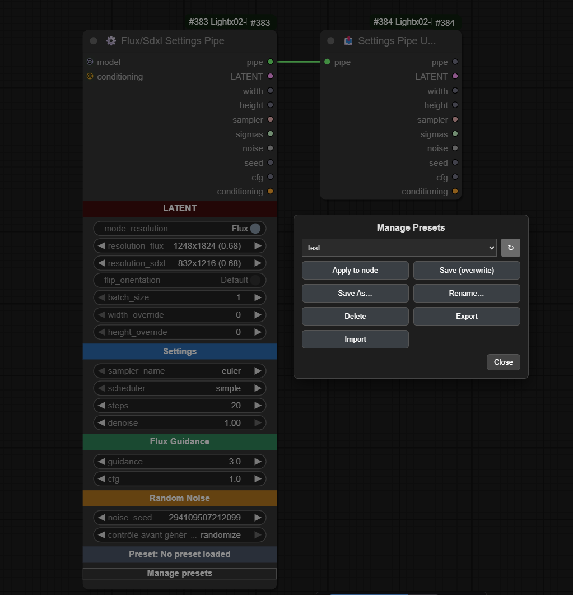
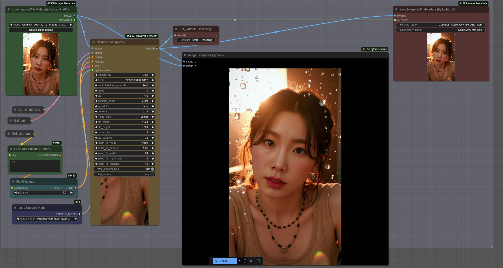
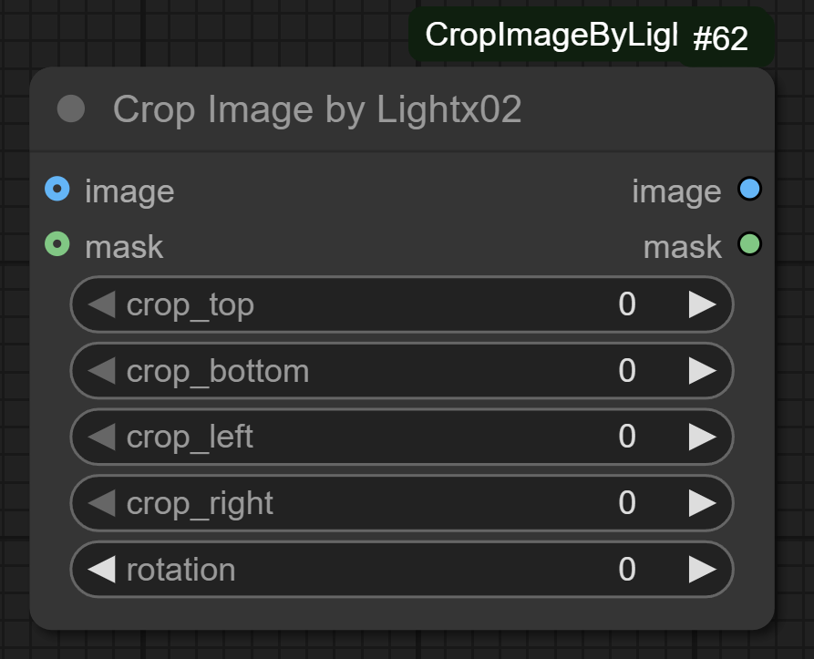

# ComfyUI-Lightx02-Nodes


**Description**: Custom nodes for ComfyUI by Light-x02. Optimize and simplify workflows, adding utilities, samplers, schedulers and various tools (Flux, images, etc.) to enrich and extend ComfyUI’s capabilities.

This repository brings together several custom nodes developed to make ComfyUI more powerful and modular.

---

## 🌐 Links & Support
- ☕ **Ko-fi** → [https://ko-fi.com/light_x02](https://ko-fi.com/light_x02)  
- 🖼️ **Civitai** → [https://civitai.com/user/Light_x02](https://civitai.com/user/Light_x02)  
- 📷 **Facebook** → [https://www.facebook.com/Unrealeterna](https://www.facebook.com/Unrealeterna)

---

## 🧩 Installation

### Method 1: Install via ComfyUI Manager

2. Go to the **Custom Nodes** section in the interface.
3. Search for **"Light-x02_Nodes"** and install it directly from the ComfyUI Manager.
4. **Restart ComfyUI**  
   Restart ComfyUI to load the node.

### Method 2: Clone the Repository
1. Open a terminal or command prompt.
2. Run the following command to clone the repository:
   ```bash
   git clone https://github.com/Light-x02/ComfyUI-Lightx02-Nodes.git
   ```
3. **Restart ComfyUI**  
   Once the files are in place, restart ComfyUI to load the node.

---

## 🧩 Custom Nodes

<details>
<summary>⚙️ Flux/SDXL Settings Pipe & 📤 Settings Pipe Unpack</summary>

### ComfyUI — ⚙️ Flux/SDXL Settings Pipe & 📤 Settings Pipe Unpack

> These two nodes are designed to simplify **Flux** and **SDXL** workflows: a single node to configure resolution and sampling parameters, and a second node to unpack fields from the **pipe**.

---

### ⚙️ Flux/SDXL Settings Pipe

#### Description
Central node that **prepares settings** for **Flux** *or* **SDXL**. It offers two lists of model-specific resolutions (Flux vs SDXL) and a **switch** (`mode_resolution`) to toggle between them. It computes and outputs a **pipe** (structured object) containing everything needed for proper sampling, along with individual outputs (latent, width/height, sampler, sigmas, etc.).

#### Main Features
- **Flux/SDXL switchable mode** (`mode_resolution`) with **resolutions adapted** to each model family.
- **Preset resolutions** + **overrides** (`width_override`, `height_override`) and **flip orientation** (swap W/H) for faster setup.
- **Sampler & Scheduler**: select from ComfyUI’s official samplers and schedulers.
- **Steps & Denoise**: fine control over iteration count and denoising strength.
- **Guidance & CFG**: manage guidance (written into conditioning) and expose a dedicated **CFG**.
- **Seed & Noise**: generates a reusable **custom noise generator** and exposes the **seed**.
- **Colored Section Headers**: section titles in the node are **clickable**; you can change their background color.  
  - Colors are **saved locally** in your web browser (via localStorage).  
  - Each header keeps its chosen color between ComfyUI sessions.  
- **Pipe Output**: returns a full **FLUX_PIPE**, ideal for keeping workflows **clean and modular**.

#### Example Usage
1. Place **⚙️ Flux/SDXL Settings Pipe** and select **Flux** or **SDXL** using `mode_resolution`.
2. Choose `sampler_name`, `scheduler`, `steps`, `denoise`. Adjust `guidance` or `cfg` as needed.
3. Click on the **colored section headers** to adjust their background color if desired (saved in your browser).
4. Connect the **`pipe`** output to **📤 Settings Pipe Unpack** (to access clean individual outputs).


---

### 📤 Settings Pipe Unpack

#### Description
Unpacks a **FLUX_PIPE** to retrieve **all useful outputs** without cluttering the workflow. The first PIPE output allows you to **extend** the chain from the same object if needed (best practice to keep the graph clean and modular).

#### Why Use It?
- **Centralize**: a single cable from the main node to the unpack → fewer wires everywhere.
- **Extendable**: keeps `pipe` as the first output to chain other compatible nodes.
- **Readable**: results in cleaner, more maintainable workflows.

---

### Presets — Management and Best Practices

These nodes include a **preset system** (UI button **Manage presets**) that lets you **save/load** the state of the **⚙️ Flux/SDXL Settings Pipe** node.

#### What Gets Saved
- The **main widget values** of the node (resolution, Flux/SDXL mode, steps, denoise, sampler, scheduler, guidance, cfg, etc.).
- Purely **UI elements** (colored headers, management button) are **not** saved.

#### Available Operations
- **Apply to node**: apply the selected preset to the current node.
- **Save (overwrite)**: overwrite the selected preset with the node’s current values.
- **Save As…**: create a **new preset**.
- **Rename…**: rename a preset.
- **Delete**: remove a preset.
- **Export / Import**: exchange presets via JSON files.

#### Where Are Presets Stored?
- One **JSON file per preset** in the extension’s `presets/` subfolder.

---

### Compatibility
- Compatible with **Flux** and **SDXL** (resolution lists designed for each model family).
- The **pipe** is designed to remain **stable and extendable**, preventing cable clutter.

---

### Example Workflow

 

</details>

---

<details>
<summary>📝 ComfyUI Image Metadata Nodes</summary>

### ComfyUI Image Metadata Nodes

**Version**: 1.1.0

#### Description
Two complementary nodes for **ComfyUI** to **load** and **save** images while preserving **metadata**. Ideal for workflows like **upscaling** without altering original metadata.

#### How It Works
- **Image Metadata Loader** imports an image and extracts its metadata. Optional `MASK` output.
- **Image Metadata Saver** saves an image with original, unchanged metadata embedded in the PNG.

Connect the loader’s `METADATA` output to the saver’s `METADATA` input to preserve metadata across transformations.

#### Features
- **Supported formats**: PNG (metadata embedded).  
- **Optional Mask Output** from the loader.  
- **Dynamic metadata management** for complex workflows.  
- **Advanced compatibility**: metadata correctly embedded in the final PNG file.  
- **Dynamic pathing** with date/time placeholders.

#### Supported Prefixes
| Placeholder         | Description              | Scope                |
|---------------------|--------------------------|----------------------|
| `%date:yyyy%`       | Year (e.g. 2025)         | ✅ Filename / Subdir |
| `%date:yy%`         | Year short (e.g. 25)     | ✅ Filename / Subdir |
| `%date:MM%`         | Month (01–12)            | ✅ Filename / Subdir |
| `%date:dd%`         | Day (01–31)              | ✅ Filename / Subdir |
| `%date:yyyy-MM%`    | Year-Month               | ✅ Filename / Subdir |
| `%date:yyyy-MM-dd%` | Full Date                | ✅ Filename / Subdir |
| `%time:HH%`         | Hour (24h)               | ✅ Filename / Subdir |
| `%time:mm%`         | Minute                   | ✅ Filename / Subdir |
| `%time:ss%`         | Second                   | ✅ Filename / Subdir |
| `%time:HH-mm-ss%`   | Full Time                | ✅ Filename / Subdir |
| `%datetime:full%`   | Full datetime            | ✅ Filename only ⚠️  |

> ⚠️ `%datetime:full%` is **not allowed** in `subdirectory_name`.

#### Usage

**Image Metadata Loader**  
- **Outputs**:  
  - `IMAGE`: The loaded image.  
  - `METADATA`: The raw metadata.  
  - `MASK`: Optional mask output.

**Image Metadata Saver**  
- **Inputs**:  
  - `IMAGE`: The image to save.  
  - `METADATA`: The metadata to include (optional).  
- **Options**:  
  - **Filename Prefix** (e.g., `%date:yyyy-MM-dd%`).  
  - **Subdirectory Name** (can be dynamically generated).

#### Example Workflow
1. Load image & metadata with **Image Metadata Loader**.  
2. Process image (e.g., upscale).  
3. Connect `METADATA` (loader) → `METADATA` (saver).  
4. Save with **Image Metadata Saver**.



#### Additional Notes
For txt2img metadata in PNG, I use **ComfyUI-ImageMetadataExtension**:  
<https://github.com/edelvarden/ComfyUI-ImageMetadataExtension>

#### Contribution
Issues/PRs welcome:  
<https://github.com/Light-x02/ComfyUI-Image-Metadata-Nodes>

</details>

---

<details>
<summary>✂️ Crop Image</summary>

### Crop Image

`CropImage` is a **ComfyUI** node to crop an image (and optionally its mask) using **pixel values**.

#### Features
- Crop from all 4 sides: `crop_top`, `crop_bottom`, `crop_left`, `crop_right`  
- Values are given directly in **pixels**  
- Supports images and masks  
- Optional **rotation** with automatic white fill (255 for masks)  
- No automatic resizing → output keeps the exact cropped size  

#### Parameters
- **crop_top**: pixels to crop from the top  
- **crop_bottom**: pixels to crop from the bottom  
- **crop_left**: pixels to crop from the left  
- **crop_right**: pixels to crop from the right  
- **rotation**: rotation angle in degrees (clockwise), with expansion and white fill

#### Returns
- **image**: the cropped (and rotated) image  
- **mask**: the cropped mask (if provided)

#### Example usage
Crop an image of 2600×1104 to keep only the area `x=1352, y=136, width=1248, height=832`:  
- `crop_left = 1352`  
- `crop_right = 0`  
- `crop_top = 136`  
- `crop_bottom = 136`  

Output will be **1248×832**.

---

✦ Category: `lightx02`  
✦ Display name in ComfyUI: **Crop Image**



</details>

---

## ⚠️ Notes — Avoid Duplicate Installations

If you already installed the **standalone** versions of these nodes from my other repositories, **please uninstall those standalones** to prevent duplicate registration and conflicts:

- **✂️ Crop Image** — standalone repo: https://github.com/Light-x02/ComfyUI_Crop_Image_By_Lightx02
- **📝 ComfyUI Image Metadata Nodes** — standalone repo: https://github.com/Light-x02/ComfyUI-Image-Metadata-Nodes

**How to remove duplicates**
1. Go to your `ComfyUI/custom_nodes/` folder.
2. Delete the folders for the standalone versions listed above (if present).
3. Restart ComfyUI.

**Symptoms of duplicates**: nodes appearing twice, “node already registered” errors, or import failures when starting ComfyUI.


## 📄 License
Unless otherwise stated in the repository, this project is released under the **MIT License**.
