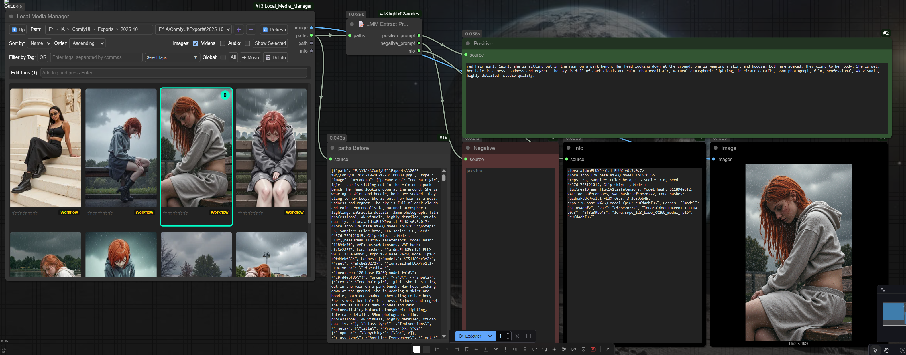

⭐ **Give a star, it shines and keeps us motivated! ✨**

# ComfyUI-Lightx02-Nodes


**Description**: Custom nodes for ComfyUI by Light-x02. Optimize and simplify workflows, adding utilities, samplers, schedulers and various tools (Flux, images, etc.) to enrich and extend ComfyUI’s capabilities.

This repository brings together several custom nodes developed to make ComfyUI more powerful and modular.

---

## 🌐 Links & Support
- ☕ **Ko-fi** → [https://ko-fi.com/light_x02](https://ko-fi.com/light_x02)  
- 🖼️ **Civitai** → [https://civitai.com/user/Light_x02](https://civitai.com/user/Light_x02)  
- 📷 **Facebook** → [https://www.facebook.com/Unrealeterna](https://www.facebook.com/Unrealeterna)

---

## 🧩 Installation

### Method 1: Install via ComfyUI Manager

2. Go to the **Custom Nodes** section in the interface.
3. Search for **"ComfyUI-Lightx02-Nodes"** and install it directly from the ComfyUI Manager.
4. **Restart ComfyUI**  
   Restart ComfyUI to load the node.

### Method 2: Clone the Repository
1. Open a terminal or command prompt.
2. Run the following command to clone the repository:
   ```bash
   git clone https://github.com/Light-x02/ComfyUI-Lightx02-Nodes.git
   ```
3. **Restart ComfyUI**  
   Once the files are in place, restart ComfyUI to load the node.

---

## Compatibility
Compatible with the extension [ComfyUI-ImageMetadataExtension](https://github.com/edelvarden/ComfyUI-ImageMetadataExtension). This integration ensures metadata compatibility with **Civitai**, allowing details such as sampler, steps, guidance, prompt, and seed to be correctly captured and displayed on the Civitai platform.

---

<details>
<summary>CHANGELOG</summary>

#### Changelog
- **2025-12-16 — Fixed**: 🧱 Universal Latent Settings (FLUX / SDXL / Z-image): After switching workflows and coming back, the node could generate at **1536×1536** even if another resolution was displayed. The selected resolution is now always applied correctly.

</details>

---

## 🧩 Custom Nodes

<details>
<summary>⚙️ Flux/SDXL Settings Pipe & 📤 Settings Pipe Unpack</summary>

### ComfyUI — ⚙️ Flux/SDXL Settings Pipe & 📤 Settings Pipe Unpack

> These two nodes are designed to simplify **Flux** and **SDXL** workflows: a single node to configure resolution and sampling parameters, and a second node to unpack fields from the **pipe**.

---

### ⚙️ Flux/SDXL Settings Pipe

#### Description
Central node that **prepares settings** for **Flux** *or* **SDXL**. It offers two lists of model-specific resolutions (Flux vs SDXL) and a **switch** (`mode_resolution`) to toggle between them. It computes and outputs a **pipe** (structured object) containing everything needed for proper sampling, along with individual outputs (latent, width/height, sampler, sigmas, etc.).

#### Main Features
- **Flux/SDXL switchable mode** (`mode_resolution`) with **resolutions adapted** to each model family.
- **Preset resolutions** + **overrides** (`width_override`, `height_override`) and **flip orientation** (swap W/H) for faster setup.
- **Sampler & Scheduler**: select from ComfyUI’s official samplers and schedulers.
- **Steps & Denoise**: fine control over iteration count and denoising strength.
- **Guidance & CFG**: manage guidance (written into conditioning) and expose a dedicated **CFG**.
- **Seed & Noise**: generates a reusable **custom noise generator** and exposes the **seed**.
- **Colored Section Headers**: section titles in the node are **clickable**; you can change their background color.  
  - Colors are **saved locally** in your web browser (via localStorage).  
  - Each header keeps its chosen color between ComfyUI sessions.  
- **Pipe Output**: returns a full **FLUX_PIPE**, ideal for keeping workflows **clean and modular**.

#### Example Usage
1. Place **⚙️ Flux/SDXL Settings Pipe** and select **Flux** or **SDXL** using `mode_resolution`.
2. Choose `sampler_name`, `scheduler`, `steps`, `denoise`. Adjust `guidance` or `cfg` as needed.
3. Click on the **colored section headers** to adjust their background color if desired (saved in your browser).
4. Connect the **`pipe`** output to **📤 Settings Pipe Unpack** (to access clean individual outputs).


---

### 📤 Settings Pipe Unpack

#### Description
Unpacks a **FLUX_PIPE** to retrieve **all useful outputs** without cluttering the workflow. The first PIPE output allows you to **extend** the chain from the same object if needed (best practice to keep the graph clean and modular).

#### Why Use It?
- **Centralize**: a single cable from the main node to the unpack → fewer wires everywhere.
- **Extendable**: keeps `pipe` as the first output to chain other compatible nodes.
- **Readable**: results in cleaner, more maintainable workflows.

---

### Presets — Management and Best Practices

These nodes include a **preset system** (UI button **Manage presets**) that lets you **save/load** the state of the **⚙️ Flux/SDXL Settings Pipe** node.

#### What Gets Saved
- The **main widget values** of the node (resolution, Flux/SDXL mode, steps, denoise, sampler, scheduler, guidance, cfg, etc.).
- Purely **UI elements** (colored headers, management button) are **not** saved.

#### Available Operations
- **Apply to node**: apply the selected preset to the current node.
- **Save (overwrite)**: overwrite the selected preset with the node’s current values.
- **Save As…**: create a **new preset**.
- **Rename…**: rename a preset.
- **Delete**: remove a preset.
- **Export / Import**: exchange presets via JSON files.

#### Where Are Presets Stored?
- One **JSON file per preset** in the extension’s `presets/` subfolder.

---

### Compatibility
- Compatible with **Flux** and **SDXL** (resolution lists designed for each model family).
- The **pipe** is designed to remain **stable and extendable**, preventing cable clutter.

---

### Example Workflow

 

</details>

---

<details>
<summary>🧱 Universal Latent Settings (FLUX / SDXL / Z-image)</summary>

### 🧱 Universal Latent Settings (FLUX / SDXL / Z-image)


#### Description
A single **latent-only** node that generates an **empty LATENT** at the correct size, with a clean UI designed to quickly switch between **FLUX**, **SDXL**, and the new **Z-image** resolution sets.

The resolution list is dynamic thanks to JavaScript:
- The **Model resolution** dropdown lets you choose the model family.
- The **Resolution** dropdown updates instantly with the matching list.

---

#### Inputs
- **model_resolution**: `FLUX`, `SDXL`, `Z-image (1024)`, `Z-image (1280)`, `Z-image (1536)`
- **resolution**: list dynamically filtered according to the selected model
- **flip_orientation**: swaps width/height
- **batch_size**: latent batch size
- **width_override / height_override**: optional manual override (takes priority over the selected resolution)

---

#### Outputs
- **LATENT**
- **width**
- **height**

---

#### Notes
- The dynamic UI is handled by the script located in the extension’s `js/` folder.

</details>

---

<details>
<summary>⚙️ Node Presets Universal</summary>

# Node Presets Universal

## Description
**Node Presets Universal** is a **ComfyUI extension** that allows you to **save, load, rename, delete, export, and import presets** for **any node** directly via the **right-click context menu**.  

Unlike node-specific preset systems, this extension is **universal**: it works on almost all nodes without requiring code modifications.

⚠️ **Limitation**: Some nodes that rely heavily on JavaScript for dynamic UI (e.g., *Power Lora Loader*) may not be fully compatible.

---

## Features

### Context Menu Integration
- Adds a **"Presets" submenu** to **all nodes** in ComfyUI.
- Accessed by right-clicking a node → **Presets**.

### Preset Management
- **Save Preset…**: Save the current widget values of the node as a preset.
- **Load Preset…**: Load a previously saved preset into the node.
- **Delete Preset…**: Permanently delete a saved preset.
- **Manage…**: Open a **dedicated management dialog** with advanced options.

### Manage Dialog
A lightweight UI that lets you:
- **Apply to node**: Load the selected preset onto the node.
- **Save (overwrite)**: Overwrite the current preset with the node’s values.
- **Save As…**: Save the current configuration under a new preset name.
- **Rename…**: Rename a preset without losing its values.
- **Delete**: Remove the selected preset.
- **Export (selected)**: Export one preset to JSON.
- **Export (all)**: Export all presets of a node type to JSON.
- **Import**: Import presets from JSON files.

### Storage System
- **One file per node type**: presets are stored per node type in a `.json` file.
- **Location**: stored under `ComfyUI\User\default\preset_nodes`.
- Presets are saved differently depending on ComfyUI’s storage mode:
  - **Server mode** → stored via API.
  - **Local mode** → stored in browser localStorage.

### Current Preset Tracking
- The currently applied preset name is stored per node ID in localStorage.
- This is **cosmetic**: it helps you remember which preset was last used.

---

## Example Workflow

1. Right-click on any node → **Presets → Save preset…**.  
2. Give it a name (e.g., *High Quality Sampling*).  
3. Later, right-click the node → **Presets → Load preset… → High Quality Sampling**.  
4. Use **Manage…** for advanced actions like renaming, exporting, or batch importing presets.

---

## Limitations
- Some JavaScript-based nodes with dynamic UIs (e.g. *Power Lora Loader*) may not correctly serialize/restore all widget values.  
- Only widgets with standard serializable values (combo, int, float, text, checkbox, etc.) are supported. Buttons, separators, and UI-only widgets are ignored.  

</details>

---

<details>
<summary>🎨 Link Colors (I/O)</summary>

# 🎨 Link Colors (I/O) — Quick Explanation

## What does it do?

This extension colors the **workflow links** based on the **type of the output** and **input**, then falls back to ComfyUI’s default color if nothing is defined. The rendering remains faithful to the ComfyUI/LiteGraph color palette.

---

## How the color is chosen

Order of resolution (from most specific to most generic):

1. **Color of the output type** (global mapping `LGraphCanvas.link_type_colors`).
2. **Color of the input type** (same mapping).
3. **Color provided by the renderer** (`renderLink`, if present) as a fallback.
4. **`LiteGraph.LINK_COLOR`**: default color (green) if nothing else is found.

> Note: “generic” types (`*`, `ANY`, etc.) are not blended; the most specific available color is preferred.

---

## Why this extension?

In some graphs, the link color stayed stuck with the **default color** when the path passed through “generic” nodes (e.g. **Reroute**, **Any Switch**/**Any**), even if the actual source was a specific type (e.g. **VAE**). This extension fixes that by evaluating the **actual output and input** of each link, **prioritizing specific types**, and avoiding mixing with generic ones. This way, the link correctly inherits a **color consistent with its real type** instead of staying on the fallback.

---

## On/Off without side effects

- A context menu item (right-click anywhere) "**🎨 Enable Link Colors (I/O)**" allows you to toggle the feature.
- **ON**: the patch attaches to `renderLink` and applies the logic above.
- **OFF**: the patch detaches and **ComfyUI returns to its original rendering**.

> The state is saved in `localStorage` (`linkcolors_enabled`) and persists between sessions.

---

## Summary

- **Respects** the global ComfyUI palette (including the **default green**).
- **I/O-aware**: considers both input and output types.
- **Reversible**: toggle that **restores native behavior** when disabled.
- **Persistent**: your preference is automatically saved.

---

### Example Before/After

[🎥 Watch the demo on YouTube](https://www.youtube.com/watch?v=_RBKrX7o9zQ)

</details>

---

<details>
<summary>📝 ComfyUI Image Metadata Nodes</summary>

### ComfyUI Image Metadata Nodes

**Version**: 1.1.0

#### Description
Two complementary nodes for **ComfyUI** to **load** and **save** images while preserving **metadata**. Ideal for workflows like **upscaling** without altering original metadata.

#### How It Works
- **Image Metadata Loader** imports an image and extracts its metadata. Optional `MASK` output.
- **Image Metadata Saver** saves an image with original, unchanged metadata embedded in the PNG.

Connect the loader’s `METADATA` output to the saver’s `METADATA` input to preserve metadata across transformations.

#### Features
- **Supported formats**: PNG (metadata embedded).  
- **Optional Mask Output** from the loader.  
- **Dynamic metadata management** for complex workflows.  
- **Advanced compatibility**: metadata correctly embedded in the final PNG file.  
- **Dynamic pathing** with date/time placeholders.

#### Supported Prefixes
| Placeholder         | Description              | Scope                |
|---------------------|--------------------------|----------------------|
| `%date:yyyy%`       | Year (e.g. 2025)         | ✅ Filename / Subdir |
| `%date:yy%`         | Year short (e.g. 25)     | ✅ Filename / Subdir |
| `%date:MM%`         | Month (01–12)            | ✅ Filename / Subdir |
| `%date:dd%`         | Day (01–31)              | ✅ Filename / Subdir |
| `%date:yyyy-MM%`    | Year-Month               | ✅ Filename / Subdir |
| `%date:yyyy-MM-dd%` | Full Date                | ✅ Filename / Subdir |
| `%time:HH%`         | Hour (24h)               | ✅ Filename / Subdir |
| `%time:mm%`         | Minute                   | ✅ Filename / Subdir |
| `%time:ss%`         | Second                   | ✅ Filename / Subdir |
| `%time:HH-mm-ss%`   | Full Time                | ✅ Filename / Subdir |
| `%datetime:full%`   | Full datetime            | ✅ Filename only ⚠️  |

> ⚠️ `%datetime:full%` is **not allowed** in `subdirectory_name`.

#### Usage

**Image Metadata Loader**  
- **Outputs**:  
  - `IMAGE`: The loaded image.  
  - `METADATA`: The raw metadata.  
  - `MASK`: Optional mask output.

**Image Metadata Saver**  
- **Inputs**:  
  - `IMAGE`: The image to save.  
  - `METADATA`: The metadata to include (optional).  
- **Options**:  
  - **Filename Prefix** (e.g., `%date:yyyy-MM-dd%`).  
  - **Subdirectory Name** (can be dynamically generated).

#### Example Workflow
1. Load image & metadata with **Image Metadata Loader**.  
2. Process image (e.g., upscale).  
3. Connect `METADATA` (loader) → `METADATA` (saver).  
4. Save with **Image Metadata Saver**.


#### Additional Notes
For txt2img metadata in PNG, I use **ComfyUI-ImageMetadataExtension**:  
<https://github.com/edelvarden/ComfyUI-ImageMetadataExtension>

#### Contribution
Issues/PRs welcome:  
<https://github.com/Light-x02/ComfyUI-Image-Metadata-Nodes>

</details>

---

<details>
<summary>✂️ Crop Image</summary>

### Crop Image

`CropImage` is a **ComfyUI** node to crop an image (and optionally its mask) using **pixel values**.

#### Features
- Crop from all 4 sides: `crop_top`, `crop_bottom`, `crop_left`, `crop_right`  
- Values are given directly in **pixels**  
- Supports images and masks  
- Optional **rotation** with automatic white fill (255 for masks)  
- No automatic resizing → output keeps the exact cropped size  

#### Parameters
- **crop_top**: pixels to crop from the top  
- **crop_bottom**: pixels to crop from the bottom  
- **crop_left**: pixels to crop from the left  
- **crop_right**: pixels to crop from the right  
- **rotation**: rotation angle in degrees (clockwise), with expansion and white fill

#### Returns
- **image**: the cropped (and rotated) image  
- **mask**: the cropped mask (if provided)

#### Example usage
Crop an image of 2600×1104 to keep only the area `x=1352, y=136, width=1248, height=832`:  
- `crop_left = 1352`  
- `crop_right = 0`  
- `crop_top = 136`  
- `crop_bottom = 136`  

Output will be **1248×832**.

---

✦ Category: `lightx02`  
✦ Display name in ComfyUI: **Crop Image**


</details>

---

<details>
<summary>🔗 Pipe 5 -30 CH Any</summary>

### 🔗 Pipe 5 -30 CH Any


#### Description
These four **Pipe** nodes are designed to carry and propagate **any type of data** through a workflow using a single, clean connection.

They are ideal for keeping graphs readable by grouping multiple signals into one structure, then forwarding everything downstream via the **`pipe` output**.

They are also **compatible with Subgraphs**, making them useful for modular workflows where you want to pass a whole “bundle” of data across graph boundaries.

---

#### Nodes Included
- **Pipe 5 CH Any**
- **Pipe 10 CH Any**
- **Pipe 20 CH Any**
- **Pipe 30 CH Any**

---

#### How It Works
- Each node provides:
  - one main **`pipe`** input and output (to propagate the bundle),
  - multiple **`any`** channels (5 / 10 / 20 / 30) to carry any data type (`IMAGE`, `LATENT`, `MODEL`, `VAE`, `MASK`, `CONDITIONING`, etc.).
- You can:
  - inject data into any channel,
  - forward everything through **`pipe`**,
  - retrieve the same channels later in the workflow by connecting another Pipe node.

---

#### Why Use It?
- Cleaner workflows: fewer long cables crossing the graph.
- Easier modularity: bundle data once, reuse it anywhere.
- Subgraph-friendly: pass a single connection in and out of Subgraphs while keeping all signals intact.

</details>

---

<details>
<summary>🔗 Pipe Hub</summary>

# 🔗 Pipe Hub

Video: 


## 🧩 Description

The **🔗 Pipe Hub** is a universal node designed to **carry and merge any type of data** within ComfyUI.\
It acts as an **intelligent multiplexer**, capable of linking multiple data streams — `IMAGE`, `MASK`, `LATENT`, `VAE`, `MODEL`, etc. — inside a single, unified “pipe.”\
It helps to **keep workflows clean and readable**, avoiding messy wires crossing the workspace by grouping everything into a single organized flow.

Both **inputs and outputs** of the Pipe Hub accept any connection type (`AnyType("*")`).\
This allows you to freely connect heterogeneous nodes without worrying about data types.

---

## ⚙️ Functionality

Each **Pipe Hub** includes:

- A special input `` (connection from another Pipe Hub),
- A main output `` (to transmit data to other Pipe Hubs or nodes),
- Multiple dynamic **input/output pairs** (`in1/out1`, `in2/out2`, etc.),
- A `` button to resynchronize structure and port labels.

When a link is connected to an input (`inX`), a **new pair** is automatically added.\
Conversely, when an input becomes unused, the extra port disappears.

### 🧤 Automatic Naming

The Pipe Hub **automatically copies the names** of upstream connections.\
For example:

- If an `IMAGE` output is connected, the input will be renamed `IMAGE`.
- If multiple links of the same type are added, the names become `IMAGE`, `IMAGE_1`, `IMAGE_2`, etc.

---

## 🔁 Serial Usage

Pipe Hubs can be **chained in series**:

```
[Pipe Hub 1] → [Pipe Hub 2] → [Pipe Hub 3]
```

Each hub inherits names and types from the previous one, allowing data signals to flow seamlessly through an entire network.\
You can even **insert new links anywhere** in the chain — downstream Pipe Hubs will update automatically.

---

## 🧱 The “Fix” Button

The **Fix** button recalculates and synchronizes the entire connected network:

- Fixes missing or extra ports,
- Restores input and output names,
- Updates connected Pipe Hubs upstream and downstream.

### ⚠️ Current Limitation

The **Fix** button **does not propagate beyond a Set/Get Node** (see below).\
In other words:

> If your network contains a `SetNode` and a `GetNode`, you must click **Fix** on **both sides** of this pair to fully refresh the network.

---

## 🔌 Compatibility with SetNode / GetNode (rgthree)

The 🔗 Pipe Hub is fully compatible with the\
[`SetNode`](https://github.com/rgthree/rgthree-comfy) and [`GetNode`](https://github.com/rgthree/rgthree-comfy) nodes from the **rgthree-comfy** project.

Thanks to this compatibility:

- You can **store** a pipe using `SetNode` under a name (e.g., `pipe`),
- Then **retrieve** it later in the workflow using `GetNode`,
- While keeping the full structure and naming of the Pipe Hub intact.

---

## 🔄 Example Flow

```
[Pipe Hub A] → [SetNode (pipe)] → [GetNode (pipe)] → [Pipe Hub B]
```

- Data flows correctly between A and B through Set/Get.\


- When the flow changes, click **Fix** on A **and** on B to refresh all ports.

---

## 🧠 Usage Tips

- The Pipe Hub supports up to **30 input/output pairs** per node.\


- You can insert intermediate nodes (`Reroute`, `ControlNet`, etc.) without breaking the chain.\


- Use **Fix** after moving or deleting pipes to keep the network clean.\


- Avoid connecting multiple Pipe Hubs to the same `SetNode` key — this may cause naming conflicts.

---

## 🧩 Summary

| Function          | Description                                                      |
| ----------------- | ---------------------------------------------------------------- |
| **pipe\_in**      | Main input, receives a flow from another Pipe Hub                |
| **pipe**          | Main output, sends the complete flow to other Pipe Hubs or nodes |
| **inN / outN**    | Dynamic port pairs accepting any type                            |
| **Fix**           | Synchronizes ports and labels across the network                 |
| **Compatibility** | Reroute, Set/GetNode (rgthree), multi-chains, auto-naming        |
| **Limitation**    | Fix does not yet automatically traverse Set/GetNodes             |

---

## 🔗 Resources

- rgthree-comfy repository: [https://github.com/rgthree/rgthree-comfy](https://github.com/rgthree/rgthree-comfy)

---


</details>

---

<details>
<summary>📝 LMM Extract Prompts</summary>

**Purpose**  
ComfyUI node that interfaces with **Local Media Manager** by **Firetheft** to extract:
- **positive_prompt** (with `<lora:...>` tags removed),
- **negative_prompt** (with `<lora:...>` tags removed),
- **info** (only `<lora:...>` tags + the section starting at `Steps:`).

> Connects to Firetheft’s **Local Media Manager** node:  
> https://github.com/Firetheft/ComfyUI_Local_Media_Manager

---

## Connection
- **Input**: `paths` (connect the **`paths`** output from the *Local Media Manager* node).
- **Outputs**:  
  - `positive_prompt : STRING`  
  - `negative_prompt : STRING`  
  - `info : STRING`

---

## Behavior
- Removes all `<lora:...>` tags from **positive/negative** prompts.
- `info` **keeps** `<lora:...>` tags and includes only the `Steps: ...` block (sampler, steps, cfg, seed, model, VAE, hashes, etc.).
- Multi-selection: concatenates prompts from multiple images.
- Ignores non-image items.



</details>

---

## ⚠️ Notes — Avoid Duplicate Installations

If you already installed the **standalone** versions of these nodes from my other repositories, **please uninstall those standalones** to prevent duplicate registration and conflicts:

- **✂️ Crop Image** — standalone repo: https://github.com/Light-x02/ComfyUI_Crop_Image_By_Lightx02
- **📝 ComfyUI Image Metadata Nodes** — standalone repo: https://github.com/Light-x02/ComfyUI-Image-Metadata-Nodes

**How to remove duplicates**
1. Go to your `ComfyUI/custom_nodes/` folder.
2. Delete the folders for the standalone versions listed above (if present).
3. Restart ComfyUI.

**Symptoms of duplicates**: nodes appearing twice, “node already registered” errors, or import failures when starting ComfyUI.


## 📄 License
Unless otherwise stated in the repository, this project is released under the **MIT License**.
