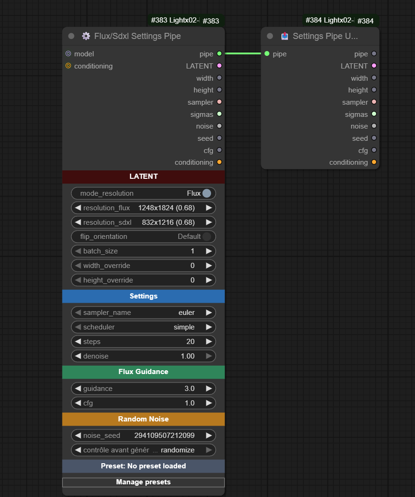

# ComfyUI-Lightx02-Nodes

**Description**: Custom nodes for ComfyUI by Light-x02. Optimize and simplify workflows, adding utilities, samplers, schedulers and various tools (Flux, images, etc.) to enrich and extend ComfyUI’s capabilities.

This repository brings together several custom nodes developed to make ComfyUI more powerful and modular.

---

## 🌐 Links & Support
- ☕ **Ko-fi** → [https://ko-fi.com/light_x02](https://ko-fi.com/light_x02)  
- 🖼️ **Civitai** → [https://civitai.com/user/Lightx02](https://civitai.com/user/Light_x02)  
- 📷 **Facebook** → [https://facebook.com/lightx02](https://www.facebook.com/Unrealeterna)

---

## 🧩 Custom Nodes

⚙️ Flux/Sdxl Settings Pipe & 📤 Settings Pipe Unpack

# ComfyUI — ⚙️ Flux/Sdxl Settings Pipe & 📤 Settings Pipe Unpack

> These two nodes are designed to simplify **Flux** and **SDXL** workflows: a single node to configure resolution and sampling parameters, and a second node to unpack fields from the **pipe**.

---

## ⚙️ Flux/Sdxl Settings Pipe

### Description

Central node that **prepares settings** for **Flux** *or* **SDXL**. It offers two lists of model-specific resolutions (Flux vs SDXL) and a **switch** (`mode_resolution`) to toggle between them. It computes and outputs a **pipe** (structured object) containing everything needed for proper sampling, along with individual outputs (latent, width/height, sampler, sigmas, etc.).

### Main Features

- **Flux/SDXL switchable mode** (`mode_resolution`) with **resolutions adapted** to each model family.
- **Preset resolutions** + **overrides** (`width_override`, `height_override`) and **flip orientation** (swap W/H) for faster setup.
- **Sampler & Scheduler**: select from ComfyUI’s official samplers and schedulers.
- **Steps & Denoise**: fine control over iteration count and denoising strength.
- **Guidance & CFG**: manage guidance (written into conditioning) and expose a dedicated **CFG**.
- **Seed & Noise**: generates a reusable **custom noise generator** and exposes the **seed**.
- **Pipe Output**: returns a full **FLUX\_PIPE**, ideal for keeping workflows **clean and modular**.

### Example Usage

1. Place **⚙️ Flux/Sdxl Settings Pipe** and select **Flux** or **SDXL** using `mode_resolution`.

2. Choose `sampler_name`, `scheduler`, `steps`, `denoise`. Adjust `guidance` or `cfg` as needed.

3. Connect the **`pipe`** output to **📤 Settings Pipe Unpack** (to access clean individual outputs).

---

## 📤 Settings Pipe Unpack

### Description

Unpacks a **FLUX\_PIPE** to retrieve **all useful outputs** without cluttering the workflow. The first PIPE output allows you to **extend** the chain from the same object if needed (best practice to keep the graph clean and modular).

### Why Use It?

- **Centralize**: a single cable from the main node to the unpack → fewer wires everywhere.
- **Extendable**: keeps `pipe` as the first output to chain other compatible nodes.
- **Readable**: results in cleaner, more maintainable workflows.

---

## Presets — Management and Best Practices

These nodes include a **preset system** (UI button **Manage presets**) that lets you **save/load** the state of the **⚙️ Flux/Sdxl Settings Pipe** node.

### What Gets Saved

- The **main widget values** of the node (resolution, Flux/SDXL mode, steps, denoise, sampler, scheduler, guidance, cfg, etc.).
- Purely **UI elements** (colored headers, management button) are **not** saved.

### Available Operations

- **Apply to node**: apply the selected preset to the current node.
- **Save (overwrite)**: overwrite the selected preset with the node’s current values.
- **Save As…**: create a **new preset**.
- **Rename…**: rename a preset.
- **Delete**: remove a preset.
- **Export / Import**: exchange presets via JSON files.

### Where Are Presets Stored?

- One **JSON file per preset** in the extension’s `presets/` subfolder.

---

## Compatibility

- Compatible with **Flux** and **SDXL** (resolution lists designed for each model family).
- The **pipe** is designed to remain **stable and extendable**, preventing cable clutter.

---

## Example Workflow

 

---

## License

Unless otherwise stated in the repo, these files are released under the MIT License.

---

📝 ComfyUI Image Metadata Nodes

# ComfyUI Image Metadata Nodes

**Version**: 1.1.0 

## Description
This project provides two complementary nodes for **ComfyUI**, allowing you to load and save images while preserving their metadata intact. These nodes are particularly useful for workflows that require image adjustments, such as **upscaling**, without altering the original metadata.

## How It Works

### Metadata Loading
The **Image Metadata Loader** node imports an image while extracting its original metadata. It also provides an optional `MASK` output.

### Metadata Saving
The **Image Metadata Saver** node saves an image with its original, unchanged metadata embedded directly in the generated PNG file.

By connecting these two nodes through the `METADATA` output/input, you can import a previously generated image with correct metadata, modify it (e.g., using upscaling), and save it while preserving the metadata intact.

## Features
- **Supported Formats**: PNG (metadata is directly embedded in the file).  
- **Optional Mask Output**: Exposes a `MASK` output from the loader node.  
- **Dynamic Metadata Management**: Preserves original metadata, even in complex workflows.  
- **Advanced Compatibility**: Metadata is correctly embedded in the final PNG file.  
- **Dynamic Pathing**: Use dynamic time/date placeholders to auto-name your outputs.

## Supported Prefixes

You can use the following placeholders in `filename_prefix` and `subdirectory_name`:

| Placeholder         | Description              | Scope                |
|---------------------|--------------------------|-----------------------|
| `%date:yyyy%`       | Year (e.g. 2025)         | ✅ Filename / Subdir  |
| `%date:yy%`         | Year short (e.g. 25)     | ✅ Filename / Subdir  |
| `%date:MM%`         | Month (01–12)            | ✅ Filename / Subdir  |
| `%date:dd%`         | Day (01–31)              | ✅ Filename / Subdir  |
| `%date:yyyy-MM%`    | Year-Month               | ✅ Filename / Subdir  |
| `%date:yyyy-MM-dd%` | Full Date                | ✅ Filename / Subdir  |
| `%time:HH%`         | Hour (24h)               | ✅ Filename / Subdir  |
| `%time:mm%`         | Minute                   | ✅ Filename / Subdir  |
| `%time:ss%`         | Second                   | ✅ Filename / Subdir  |
| `%time:HH-mm-ss%`   | Full Time                | ✅ Filename / Subdir  |
| `%datetime:full%`   | Full datetime            | ✅ Filename only ⚠️   |

⚠️ `%datetime:full%` is **not allowed** in `subdirectory_name` to prevent creating deeply nested folder structures. If used, it will trigger an error.

## Usage

### Included Nodes

#### Image Metadata Loader
- **Description**: Loads an image and extracts its metadata.  
- **Outputs**:  
  - `IMAGE`: The loaded image.  
  - `METADATA`: The raw metadata.  
  - `MASK`: Optional mask output.

#### Image Metadata Saver
- **Description**: Saves an image with unchanged metadata.  
- **Inputs**:  
  - `IMAGE`: The image to save.  
  - `METADATA`: The metadata to include (optional).  
- **Options**:  
  - **Filename Prefix**: Prefix for the file name (e.g., `%date:yyyy-MM-dd%`).  
  - **Subdirectory Name**: Folder to save into (can be dynamically generated).

### Example Workflow
1. Use the **Image Metadata Loader** node to load an image and retrieve its metadata.  
2. Modify the image (e.g., with an upscaling or retouching node).  
3. Connect the `METADATA` output of the loader to the `METADATA` input of the saver.  
4. Use **Image Metadata Saver** to save the image with intact metadata.
   

## Additional Notes

To save metadata in my PNG files when generating images with txt2img workflows, I use the extension **"ComfyUI-ImageMetadataExtension"**, which is available [here](https://github.com/edelvarden/ComfyUI-ImageMetadataExtension). This ensures that platforms like Civitai automatically detect the metadata.

## Contribution
Contributions are welcome! If you want to report a bug or suggest an improvement, open an issue or submit a pull request on the [GitHub repository](https://github.com/Light-x02/ComfyUI-Image-Metadata-Nodes).

---

✂️ Crop Image

# Crop Image

`CropImage` is a **ComfyUI** node that allows cropping an image (and optionally its mask) using **pixel values**.

## Features

- Crop from all 4 sides: `crop_top`, `crop_bottom`, `crop_left`, `crop_right`  
- Values are given directly in **pixels**  
- Supports images and masks  
- Optional **rotation** with automatic white fill (255 for masks)  
- No automatic resizing → output keeps the exact cropped size  

## Parameters

- **crop_top**: pixels to crop from the top  
- **crop_bottom**: pixels to crop from the bottom  
- **crop_left**: pixels to crop from the left  
- **crop_right**: pixels to crop from the right  
- **rotation**: rotation angle in degrees (clockwise), with expansion and white fill

## Returns

- **image**: the cropped (and rotated) image  
- **mask**: the cropped mask (if provided)

## Example usage

Crop an image of 2600×1104 to keep only the area `x=1352, y=136, width=1248, height=832`:  
- `crop_left = 1352`  
- `crop_right = 0`  
- `crop_top = 136`  
- `crop_bottom = 136`  

The output will be **1248×832 pixels**.

---

✦ Category: `lightx02`  
✦ Display name in ComfyUI: **Crop Image**

