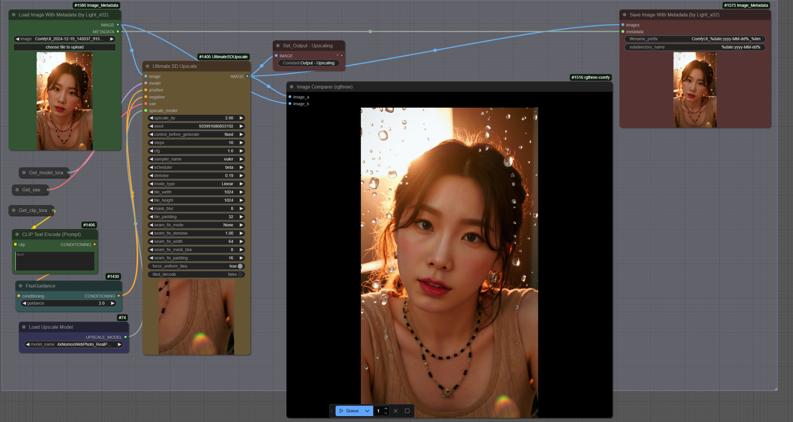

# ComfyUI Image Metadata Nodes

**Version**: 1.1.0 
**Author**: [Light-x02](https://github.com/Light-x02)

## Support My Work
If you find this project useful, you can support my work on Ko-fi:  
[https://ko-fi.com/light_x02](https://ko-fi.com/light_x02)

## Description
This project provides two complementary nodes for **ComfyUI**, allowing you to load and save images while preserving their metadata intact. These nodes are particularly useful for workflows that require image adjustments, such as **upscaling**, without altering the original metadata.

## How It Works

### Metadata Loading
The **Image Metadata Loader** node imports an image while extracting its original metadata. It also provides an optional `MASK` output.

### Metadata Saving
The **Image Metadata Saver** node saves an image with its original, unchanged metadata embedded directly in the generated PNG file.

By connecting these two nodes through the `METADATA` output/input, you can import a previously generated image with correct metadata, modify it (e.g., using upscaling), and save it while preserving the metadata intact.

## Features
- **Supported Formats**: PNG (metadata is directly embedded in the file).  
- **Optional Mask Output**: Exposes a `MASK` output from the loader node.  
- **Dynamic Metadata Management**: Preserves original metadata, even in complex workflows.  
- **Advanced Compatibility**: Metadata is correctly embedded in the final PNG file.  
- **Dynamic Pathing**: Use dynamic time/date placeholders to auto-name your outputs.

## Supported Prefixes

You can use the following placeholders in `filename_prefix` and `subdirectory_name`:

| Placeholder         | Description              | Scope                |
|---------------------|--------------------------|-----------------------|
| `%date:yyyy%`       | Year (e.g. 2025)         | ✅ Filename / Subdir  |
| `%date:yy%`         | Year short (e.g. 25)     | ✅ Filename / Subdir  |
| `%date:MM%`         | Month (01–12)            | ✅ Filename / Subdir  |
| `%date:dd%`         | Day (01–31)              | ✅ Filename / Subdir  |
| `%date:yyyy-MM%`    | Year-Month               | ✅ Filename / Subdir  |
| `%date:yyyy-MM-dd%` | Full Date                | ✅ Filename / Subdir  |
| `%time:HH%`         | Hour (24h)               | ✅ Filename / Subdir  |
| `%time:mm%`         | Minute                   | ✅ Filename / Subdir  |
| `%time:ss%`         | Second                   | ✅ Filename / Subdir  |
| `%time:HH-mm-ss%`   | Full Time                | ✅ Filename / Subdir  |
| `%datetime:full%`   | Full datetime            | ✅ Filename only ⚠️   |

⚠️ `%datetime:full%` is **not allowed** in `subdirectory_name` to prevent creating deeply nested folder structures. If used, it will trigger an error.

## Usage

### Included Nodes

#### Image Metadata Loader
- **Description**: Loads an image and extracts its metadata.  
- **Outputs**:  
  - `IMAGE`: The loaded image.  
  - `METADATA`: The raw metadata.  
  - `MASK`: Optional mask output.

#### Image Metadata Saver
- **Description**: Saves an image with unchanged metadata.  
- **Inputs**:  
  - `IMAGE`: The image to save.  
  - `METADATA`: The metadata to include (optional).  
- **Options**:  
  - **Filename Prefix**: Prefix for the file name (e.g., `%date:yyyy-MM-dd%`).  
  - **Subdirectory Name**: Folder to save into (can be dynamically generated).

### Example Workflow
1. Use the **Image Metadata Loader** node to load an image and retrieve its metadata.  
2. Modify the image (e.g., with an upscaling or retouching node).  
3. Connect the `METADATA` output of the loader to the `METADATA` input of the saver.  
4. Use **Image Metadata Saver** to save the image with intact metadata.
   

## Additional Notes

To save metadata in my PNG files when generating images with txt2img workflows, I use the extension **"ComfyUI-ImageMetadataExtension"**, which is available [here](https://github.com/edelvarden/ComfyUI-ImageMetadataExtension). This ensures that platforms like Civitai automatically detect the metadata.

## Contribution
Contributions are welcome! If you want to report a bug or suggest an improvement, open an issue or submit a pull request on the [GitHub repository](https://github.com/Light-x02/ComfyUI-Image-Metadata-Nodes).
